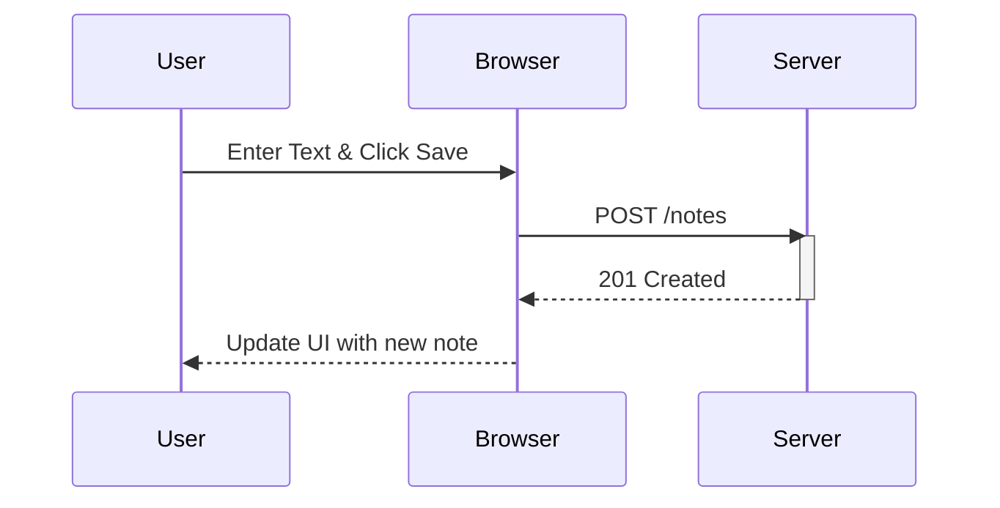

```mermaid
  sequenceDiagram
    participant User as User
    participant Browser as Browser
    participant Server as Server

    User->>Browser: Enter Text & Click Save
    Browser->>Server: POST /notes
    activate Server
    Server-->>Browser: 201 Created
    deactivate Server
    Browser-->>User: Update UI with new note

```
