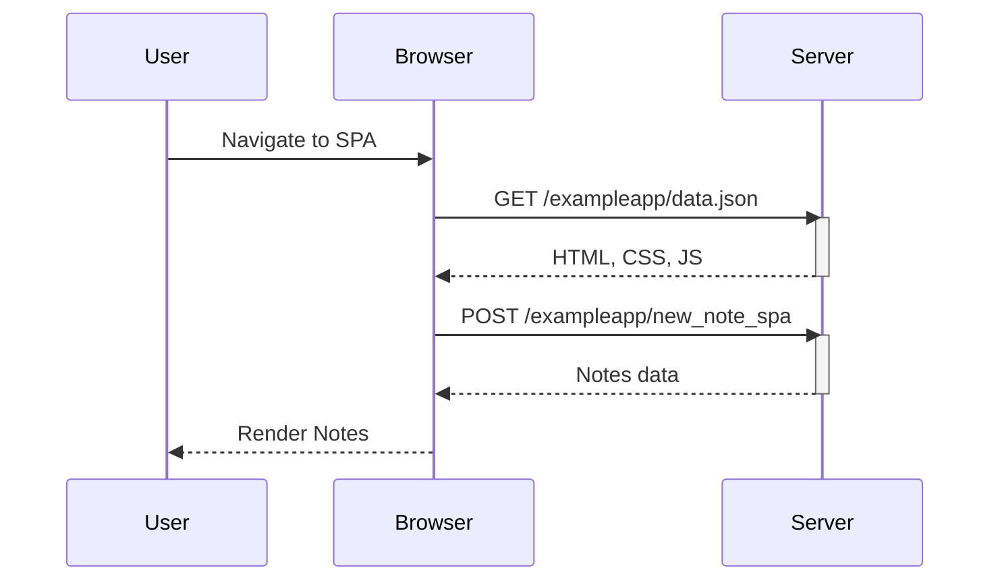

```mermaid
  sequenceDiagram
    participant User as User
    participant Browser as Browser
    participant Server as Server

    User->>Browser: Navigate to SPA
    Browser->>Server: GET /exampleapp/data.json
    activate Server
    Server-->>Browser: HTML, CSS, JS
    deactivate Server
    Browser->>Server: POST /exampleapp/new_note_spa
    activate Server
    Server-->>Browser: Notes data
    deactivate Server
    Browser-->>User: Render Notes

```
